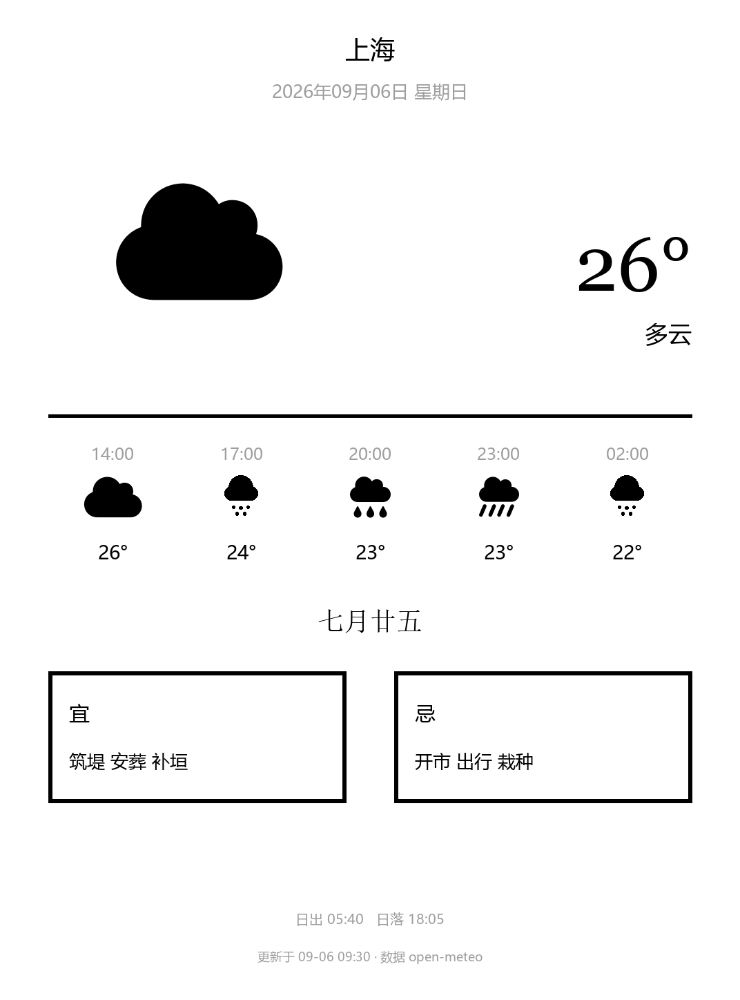
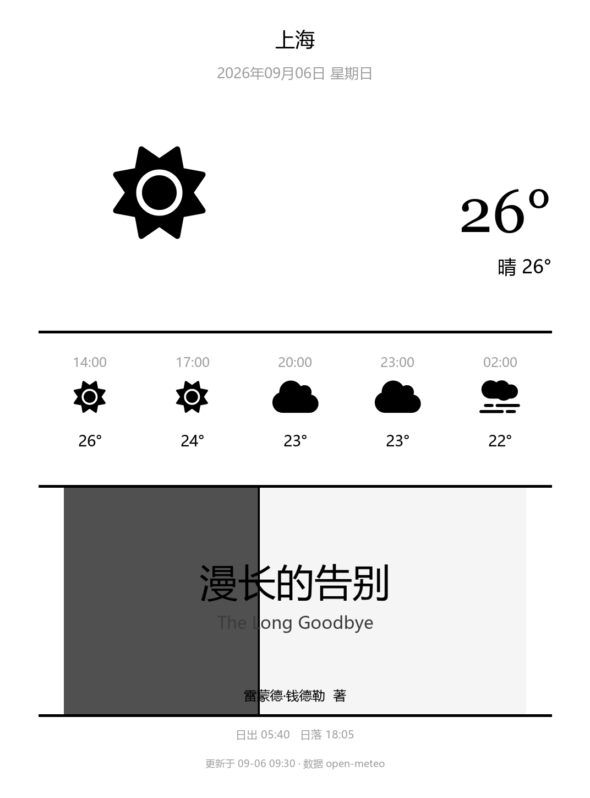

# Weatherdash · KOReader 天气壁纸（纯本地版 v3.3）

把**实时天气**变成 Kindle / KOReader 设备的**休眠屏保壁纸**：
竖屏大图上，上半屏是城市、日期、天气图标、超大当前温度与 12 小时预测，
下半屏可二选一展示 **当日黄历（农历 + 宜/忌）** 或 **最近阅读书籍封面**。

**v3 是完全本地版**：设备直接向公网**免费无 Key** 的 open-meteo 拉取天气；
黄历优先走公网免费接口（农历/干支/宜忌），失败时由插件内置的
1900–2100 农历算法**离线兜底**；壁纸在设备上用 KOReader 自带 Blitbuffer
**本地合成**为 PNG 后写入屏保目录。
**没有任何私人服务器、无需部署、无需 Key。**

- 数据源全部公开：天气 [open-meteo.com](https://open-meteo.com)（CC BY 4.0）
- 黄历：[api.mu-jie.cc](https://api.mu-jie.cc)（免费无 Key，结果缓存 24h，断网自动回落本地算法）
- IP 定位 [ip-api.com](https://ip-api.com)（仅在「我的位置 → IP 自动定位」时调用一次）
- 本地农历：公开 1900–2100 对照表 + 建除十二神推算（离线）

<center>
  
  
</center>

> 上图为 `tools/preview.py` 按 `main.lua` 的渲染逻辑模拟出的灰度示意。

## 特性

- 🖼 **e-ink 友好版式**：默认 1072×1448（Kindle Paperwhite 4，6″ 300ppi 竖屏）；
  分辨率在 `main.lua` 顶部 `W, H` 一行可改
- ☀️ 左侧天气图标 + 右侧超大当前温度（出版字体探测：Bookerly / Caecilia / Georgia）+ 描述行
- ⏱ **未来 12 小时预测条**（现在 + 每 3h ×5 点：时间 / 图标 / 温度）
- 📅 **黄历下半屏**：农历日期大字（中文衬线字体探测）+ 「宜 / 忌」两块徽章；
  宜/忌各取 3 条短句，同一项同列（自相矛盾）自动两侧删除；
  建除十二神仅用作推算索引，不外露
- 📚 **封面下半屏**：选最近阅读的书 → 本地提取书封 → 与天气本地合成一张壁纸
- 🌐 **90+ 中英城市** + IP 自动定位；城市坐标由 open-meteo geocoding 解析并缓存
- 🌡 ℃ / ℉ 一键切换
- 🔁 每日自动更新（唤醒 / 休眠前 / 每 30 分钟轮询补做，默认早 6 点后）
- 🛡 **零 gettext、零 ImageWidget**：文本经 `RenderText` 直接上 Blitbuffer；
  书封与图标库均经 `ffi/pic` 解码为 BB 再合成，不会触发精简/定制版
  KOReader（如 MiuRead）的图片渲染崩出
- 🎨 **颜色自适应**：白/黑取值直接使用 KOReader 自带 `COLOR_WHITE/COLOR_BLACK`
  常量原样传给绘制 API，兼容 8-bit 与 1-bit Blitbuffer 定制固件
- 🔌 单插件目录结构、中文菜单、`is_doc_only=false`
  （主页 / 文件浏览器 / 阅读三上下文均可见）

## 设备端流程（无服务器）

```
┌─ Kindle (KOReader) ───────────────────────────────────────────────┐
│ Weatherdash.koplugin                                             │
│  1) luasocket 直连 open-meteo（公网 https，免费无 Key）           │
│     · geocoding: 城市名 → 经纬度（结果缓存到 settings）           │
│     · forecast:  当前温度 / WMO 天气码 / 未来 12h / 日出日落      │
│  2) 黄历：公网 api.mu-jie.cc 优先（农历+干支+宜忌，缓存 24h）     │
│     · 失败回落：内置 1900–2100 农历表离线推算                     │
│  3) Blitbuffer 本地绘制 1072×1448 灰度画布：                      │
│     · 文字   → RenderText:renderUtf8Text（字体族按需探测）        │
│     · 图标   → icons/<weather>_L.png 优先（ffi/pic 解码 → blitFrom） │
│              兜底：内置 FontAwesome 字形 → 几何画法                  │
│     · 书封   → ffi/pic 解码 → scale → blitFrom 合成（可选）       │
│  4) bb:writeToFile → screensaver/dashwallpaper.png                │
└───────────────────────────────────────────────────────────────────┘
        ↑ 休眠时由 KOReader 屏保功能显示这张 PNG
```

## 安装（Kindle / 任意 KOReader 设备）

1. 把 `koplugin/Weatherdash.koplugin/` **整个目录**拷到设备的插件目录：

   ```
   /mnt/us/koreader/plugins/Weatherdash.koplugin/
   ```

2. **彻底重启** KOReader（不是插件管理页刷新，长按电源→重启最稳）。

3. 主页菜单 → **更多工具 → 天气壁纸**，点 **「应用黄历天气壁纸」**。

4. 让 Kindle 休眠即可看到壁纸。

> **首次使用需联网**一次（拉天气 + 城市坐标解析）；黄历断网也能离线推算。
> 若屏保不显示：KOReader → 设置 → 屏保 → 来源选「图片」，
> 目录指向写入路径（默认 `koreader/screensaver/`，文件名 `dashwallpaper.png`）。

> ⚠️ **MiuRead 等定制版 KOReader**：插件类已带 `is_doc_only = false`。
> 若插件管理页可见但菜单无入口，请确认已 ☑ 勾选并**完全重启**。

## 菜单说明

| 菜单 | 作用 |
|---|---|
| 应用黄历天气壁纸 | 拉天气 + 本地绘黄历壁纸（下半屏=黄历） |
| 应用书籍封面天气壁纸 | 选最近阅读的书 → 本地提取书封 + 天气合成（下半屏=封面） |
| 我的位置 | IP 自动定位 / 90+ 城市 / 恢复默认上海 |
| 温度单位 | ℃ / ℉ |
| 每日自动更新 | 开 / 关、时间、上次状态、立即更新一次 |
| 使用说明 | 内置说明 |

## 仓库结构

```
weatherdash-koreader/
├── koplugin/
│   └── Weatherdash.koplugin/     # KOReader 插件
│       ├── main.lua              #   渲染主逻辑（luaparse 校验通过）
│       ├── _meta.lua             #   元数据（version = 3.3.10）
│       ├── fonts/
│       │   └── fa-weather.ttf    #   FontAwesome 6 Free Solid 子集（4.7KB，仅字形）
│       └── icons/                #   天气图标库 PNG（与 loeffner/WeatherLockscreen 同款思路）
│           ├── sun_L.png  / sun_S.png          (260×260 / 92×92)
│           ├── partly_L.png / partly_S.png
│           ├── cloud_L.png / cloud_S.png
│           ├── fog_L.png   / fog_S.png
│           ├── drizzle_L.png / drizzle_S.png   # 小雨：几何画法（云+小圆点）
│           ├── rain_L.png  / rain_S.png        # 中雨：fa-cloud-rain
│           ├── heavy_L.png / heavy_S.png       # 大雨：fa-cloud-showers-heavy
│           ├── snow_L.png  / snow_S.png
│           └── thunder_L.png / thunder_S.png
├── tools/
│   ├── verify_lunar.py           # 农历算法回归测试（13 个锚点，纯 Python）
│   ├── verify_lunar_lua.js       # 从 main.lua 提取数据表，按 Lua 1-based 语义复算同批锚点
│   ├── subset_fa.py              # FontAwesome 6 裁剪到 fonts/fa-weather.ttf
│   ├── build_icons.py            # 生成 icons/*.png（drizzle 为几何画法，其余取自子集字体）
│   └── preview.py                # 按 main.lua 渲染逻辑出灰度示意 PNG（docs/）
├── docs/                         # 预览图
├── README.md
└── LICENSE
```

> 想换图标风格？把 `icons/<weather>_L.png` 与 `<weather>_S.png` 用你喜欢的同尺寸文件覆盖即可，
> 插件无须改动。建议图标留白与默认接近（PNG 白底黑字形）。

## 自定义

- **分辨率**：`koplugin/Weatherdash.koplugin/main.lua` 顶部 `local W, H = 1072, 1448`
  —— 改成你的设备像素即可（横屏设备可对调，布局按比例缩放）。
- **图标**：替换 `icons/<weather>_L.png` 和 `<weather>_S.png`（命名固定）。
- **字体**：温度大字按 `pub` 字体族探测（Bookerly → Caecilia → AmazonEmber →
  Georgia，均未命中回落 NotoSans）；黄历日期按 `serif` 字体族探测 CJK 衬线
  （NotoSerifCJKsc → DroidSerifFallback → NotoSerifSC → SourceHanSerifSC）。
- **城市列表**：`CITY_CHOICES`（想要更多城市直接加中文名，坐标自动 geocoding）。
- **自动更新时间窗**：`AUTO_HOURS`。
- **屏保目录**：`findScreensaverDir()` 依次探测并回退创建。

## 常见问题

| 现象 | 处理 |
|---|---|
| 壁纸文字为方块/空白 | 取不到 CJK 字体：确认设备字体已安装且 `face()` 回退链正常 |
| 提示"天气服务返回 HTTP…" | 确认已联网；open-meteo 对海外/部分网络偶发超时，稍后重试 |
| 封面模式提示"未能提取封面" | 该书无内嵌封面或无可缓存封面文件；可换一本，或改用黄历版 |
| 黄历日期不对 | 先跑 `python tools/verify_lunar.py` 自查；若设备系统时间异常也会影响 |
| 宜/忌出现同一项 | v3.3.8 起渲染前自动去冲突（两侧都删）并各只显示 3 条 |
| "明明没下雨却显示大雨" | v3.3.9 起雨势分三级：毛毛雨/小雨=云+小点（drizzle）、中雨=雨丝（rain）、大雨/强阵雨=粗长雨丝（heavy）。另注意 open-meteo 的 current 与 hourly 是同一模型但可能不一致（如当前晴间多云、模型认为白天有毛毛雨），时序条按逐小时模型数据如实显示 |
| 生成壁纸时崩出 / 壁纸异常 | 看屏保目录里的 `weatherdash_trace.log`（每次生成重写），最后一行即停止位置；把内容发 issue |
| 壁纸整片黑/白底反色 | v3.3.6 起颜色直接取设备 `COLOR_*` 常量适配 1-bit/8-bit BB，请升级后重试 |
| 插件可见但菜单无入口 | 确认 ☑ 勾选 + 完全重启；`is_doc_only=false` 已内置 |
| 想同时保留官方屏保图 | 屏保目录放多张图 + KOReader 随机模式即可，本插件只认 `dashwallpaper.png` |

## 开发 / 回归

```bash
# 农历算法回归（13 个锚点：含闰二月、闰四月、春节跨年等）
python tools/verify_lunar.py

# 用 Node 按 Lua 1-based 语义复算同批锚点（抓跨语言索引陷阱）
node tools/verify_lunar_lua.js

# 重新生成 FA 字形子集字体（需要先下载 fa-solid-900.ttf 放到 tools/）
python tools/subset_fa.py

# 由子集字体生成图标库 PNG
python tools/build_icons.py

# 预览图（需 Pillow；Windows/macOS 自带中文字体即可）
pip install Pillow
python tools/preview.py
```

## 数据源与致谢

- 天气 / 地理编码：[open-meteo.com](https://open-meteo.com)（CC BY 4.0，免费无 Key）
- 黄历：[api.mu-jie.cc](https://api.mu-jie.cc)（免费无 Key）
- IP 定位：[ip-api.com](https://ip-api.com)（免费非商用，仅 IP 自动定位时调用）
- 农历：公开的 1900–2100 农历对照表（201 项）与建除十二神推宜忌（传统简化版，仅供参阅）
- 图标：默认采用 [Font Awesome Free](https://fontawesome.com)（SIL OFL 1.1）的子集
  渲染为图标库 PNG，可被你的同尺寸图标替换
- 渲染：KOReader `ffi/blitbuffer`、`ui/rendertext`、`ui/font`、`ffi/pic` 官方 API

## License

[MIT](LICENSE)。仓库不包含任何中文字体文件；如需预览，`tools/preview.py`
会尝试使用你系统里已有的 CJK 字体。
